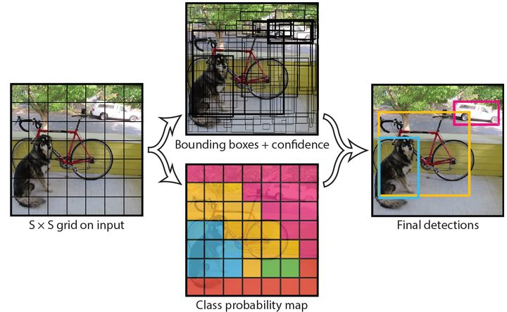

> Object Detection in 20 Years: A Survey
>
> 文章链接：https://arxiv.org/abs/1905.05055

## 一.概述

本综述的主要内容：

1.A comprehensive review in the light of technical evolutions

2.An in-depth exploration of the key technologies and the recent state of the arts

对目标检测中的一些关键技术进行介绍："multi-scale detection"，“hard negative mining”，“bounding box regression”

3.A comprehensive analysis of detection speed up techniques

- detection pipeline, e.g.,  cascaded detection, feature map shared computation

- detection backbone, e.g.,  network compression, lightweight network design

- numerical computation, e.g.,   integral image, vector quantization

4.Difficulties and Challenges in Object Detection

不同的任务具有不同的目标与约束，它们共同的挑战包括不同的视角与光照，类内差异，物体的旋转和尺度变化（小目标与大目标），物体的准确定位，聚集和遮挡的物体，检测速度等。

## 二.代表性方法

#### 1.传统方法

- **Viola Jones Detectors**

滑动窗口，积分图+特征选择（Adaboost选择最有用的特征）+级联检测

- **HOG Detector**

- **Deformable Part-based Model** 

mixture models, hard negative mining, bounding box regression等

#### 2.CNN based Two-stage Detector

- **R-CNN**

Selective Search 寻找目标候选框，CNN（尝试了Alexnet与VGG16）提取特征，SVM分类，Bounding Box Regression修正候选框

- **SPP-Net**

空间金字塔池化：输入不同大小的特征图得到相同大小的输出特征

对于语义分割问题，可以考虑ASPP

- **Fast R-CNN**

ROI Pooling，多任务损失函数

网络结构图

- **Faster R-CNN**

anchor与RPN

- **FPN**

深层的特征有利于分类，但未必有利于物体定位。

- **Mask-RCNN**

RoiAlign

#### 3.CNN based One-stage Detector

- **YOLO**

- **SSD**

相比YOLO的优势

(1)不同尺度的特征图，大尺度特征图用于检测小目标，小尺度特征图用于检测大目标

(2)加入anchors实现multibox

- **RetinaNet**

focal loss：
$$
FL(p_t)=\alpha _t(1-p_t)^\gamma log(p_t)
$$

## 三.关键技术

**1.Technical Evolution**

- Traditional Methods

- Multi-Scale Detection

- Bounding Box Regression

作为后处理（eg, DPM)，融入网络当中（eg, Faster R-CNN）

- Context Priming

局部上下文（eg, 增加感受野），全局上下文（eg, 大感受野，pooling），context interactive（eg, 物体间的约束，物体与环境的约束）

- Non-Maximum Suppression

- Hard Negative Mining

**2.Speed-up of Detection**

- Feature Map Shared Computation

特征图共享，尺度金字塔

- Speed up of Classifiers
- Cascaded Detection

从粗到细的检测，如在大场景中检测小目标

- Network Pruning and Quantifification

网络剪枝（除去不重要的权重），网络量化（eg, 网络二值化），网络蒸馏（教师网络指导学生网络（轻量级））

- Lightweight Network Design

Bottle-neck Design

 Neural Architecture Search

- Numerical Acceleration

**3.Recent Advances**

- Backbone Network

- Better Feature to keep invariance and equivariance

（1）feature fusion

（2）learning high-resolution features with large receptive fields

- Beyond Sliding Window

新的检测思路：Detection as sub-region search（迭代地搜索），Detection as key points localization

- Improvements of Localization

*Bounding Box Refinement*（eg, Cascade R-CNN，迭代地进行边框精细化），*Improving Loss Functions for Accurate Localization*

-  Learning with Segmentation

一种是分割网络作为特征提取器，许多额外地计算量；一种是训练时在Backbone后面加branch，测试时去掉。

- Others

Robust Detection of Rotation and Scale Changes，Training from Scratch，Adversarial Training，Weakly Supervised Object Detection

4.Future Directions of Object Detection

Lightweight, AutoML, domain adaptation, weakly supervised, small object, video, information fusion.

#### Reference:

1.https://zhuanlan.zhihu.com/p/192362333

2.Faster R-CNN：https://zhuanlan.zhihu.com/p/31426458

3.YOLO：https://zhuanlan.zhihu.com/p/32525231

4.SSD：https://zhuanlan.zhihu.com/p/33544892

