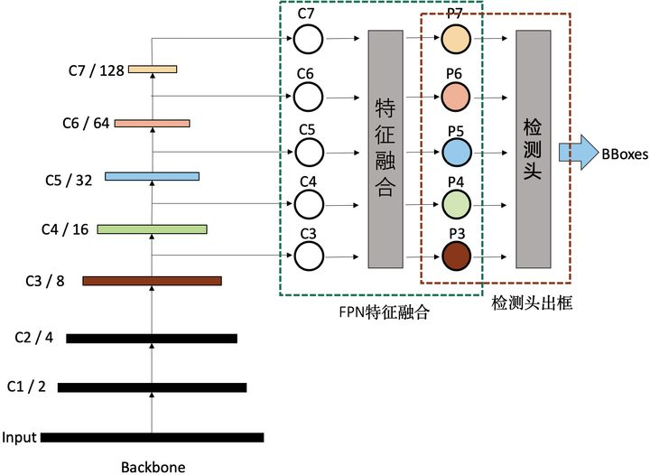
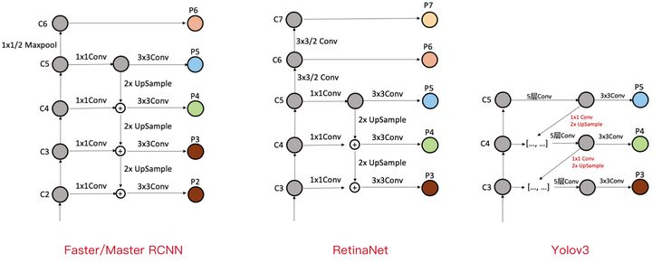
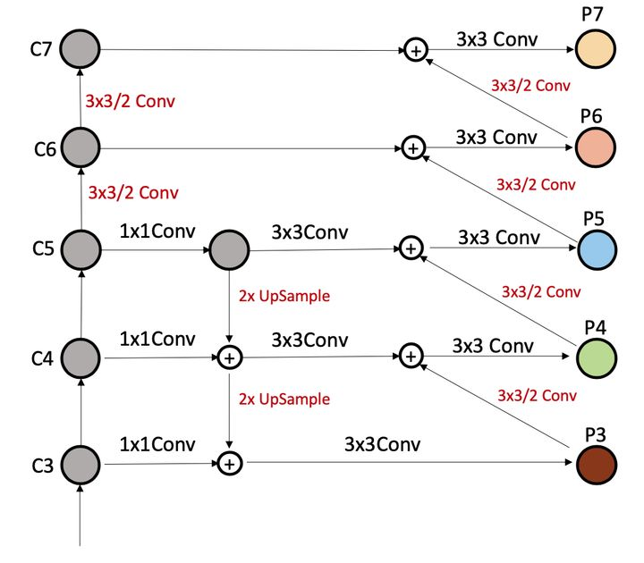
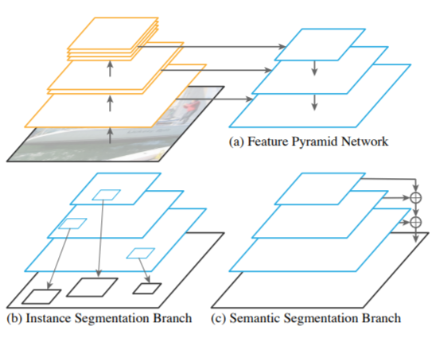
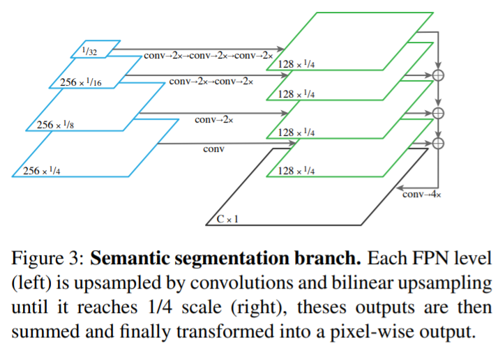

1.Feature Pyramid Networks for Object Detection

通用的FPN结构：

2.典型的FPN应用

- 无融合

SSD

- 自上而下单向融合

- 简单双向融合

PANet

3.复杂FPN结构

SFAM，ASFF，BiFPN，Recursive-FPN，Hyper column

https://blog.csdn.net/yx868yx/article/details/107383857

4.FPN与分割

- PANet

1. 原始 Mask R-CNN 没有很好地利用低层信息。高层的 Feature maps 关注物体整体，低层的 Feature maps 关注物体的纹理图案。使用低层的信息可以对物体进行更好地定位。对此 PANet 增加了 Bottom-up Path Augmentation（整体结构图中的b. ），将低层的信息又传导到高层中去，同时减少了高层到低层的信息流通需要穿过的卷积层数。
2. 原 RoI Pooling 只在最后一层上提取信息，而 PANet 则使用Adaptive Feature Pooling（AFP，整体结构图中的 c.）同时对多个层级进行 RoI Pooling ，将多层级的信息整合后进行预测。
3. 最终的 Mask 预测分支融合了 FCN 式的预测和 fully-connected 式的预测，前者关注局部，后者关注整体Context信息，从而提升最终 Mask 的质量。

- Panoptic FPN

FPN作为特征提取模块，实例分割分支+语义分割分支

PanopticFPN是在Mask R-CNN（FPN版本）的基础上进行扩展的，需要考虑如何添加语义分割分支。

#### Reference:

1.https://zhuanlan.zhihu.com/p/148738276

2.PANet：https://zhuanlan.zhihu.com/p/108895614

