> PVNet: Pixel-wise Voting Network for 6DoF Object Pose Estimation

## 一.核心思想

（1）representation  for keypoint localization：vector-field优于coordinate和heatmap

（2）vector-field representation能提供关键点的概率分布，从而可以考虑uncertainty-driven PnP

（3）RGB-D图像可用时，使用ICP优化

（4）对于多实例的情况，采用CenterNet预先进行物体检测

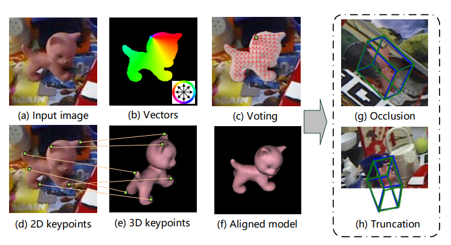

## 二.Method

PVNet输出每个像素的语义标签与指向关键点的向量。

单位向量的泛化能力强于offsets。

- RANSAC投票获得关键点

1.随机选择两个像素点，将他们的向量交点作为候选假设，重复N次生成N个关键点假设。

2.属于物体的每个像素点对这些关键点假设进行投票，得分作为假设的置信度。

3.根据这些关键点假设计算出关键点的空间概率分布，用于uncertainty-driven PnP。

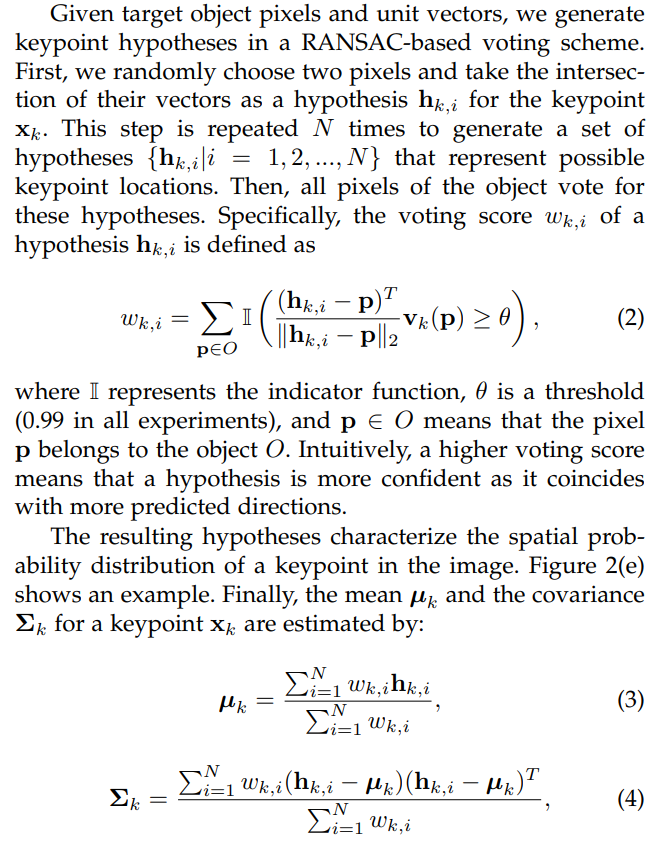

- 关键点选择

在物体表面上进行FPS采样，推荐K=8，相对于Bounding Box corners更好。

- 处理多实例情况

在PVNet前加一个目标检测器。

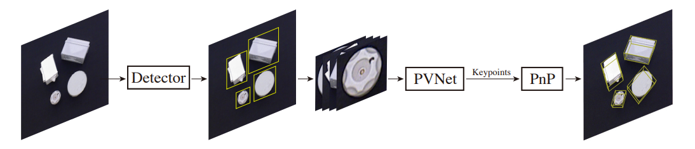

这可能无法有效的处理聚集情况。

- Uncertainty-driven PnP

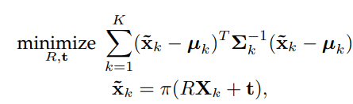

- Pose Refinement

根据语义分割的结果获得物体深度图像，然后基于 gradient descent的ICP。

## 三.Implementation

1.网络结构

输入：H×W×3的图像

输出：H ×W ×(K ×2×C) 的向量，H ×W × (C + 1)的类别概率

这里的意思似乎是一个模型可以给多个物体用，但在源码实现里为每个物体训练了一个模型。

2.训练策略

学习单位向量：smooth l1 loss

学习语义标签： softmax loss

初始学习率0.001，每隔20个epoch减半

与BB8和YOLO6D类似，在每个物体上训练一个网络（为啥要在每个物体上训练一个）

3.数据增强

10000合成样本，10000 “copy and paste“

4.运行速度

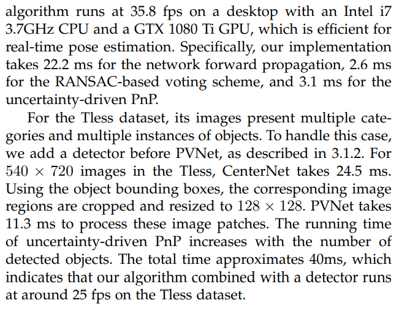

## 四.Improvement

1.DPVL

PVNet忽略了像素与关键点的距离对假设偏差的影响。

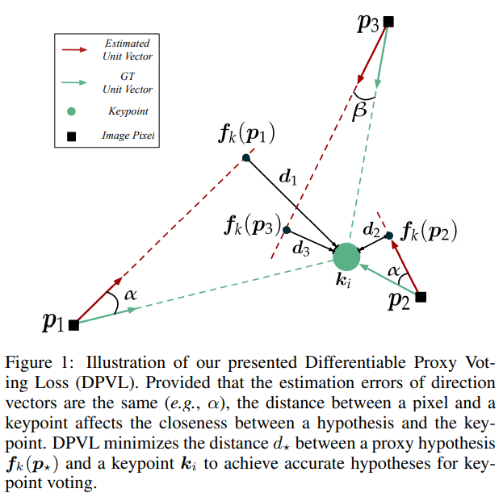

神经网络结构与PVNet相同，但是损失函数不同。

(1)语义分割损失

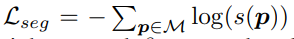

(2)向量场损失

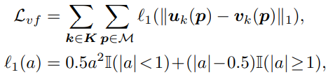

(3)Differentiable Proxy Voting Loss

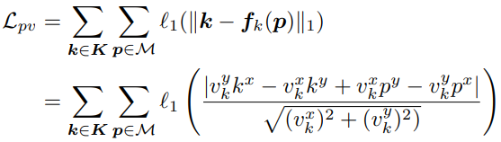

(4)总损失

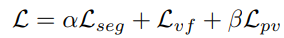

训练策略：

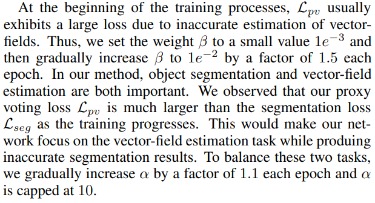

实现细节：

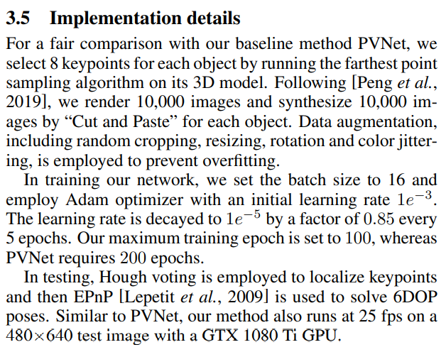

2.ASPP-DF-PVNet

（1）在解码前加了ASPP层；

（2）损失函数正则项，参考dpvl；

（3）在RANSAC投票计算分数时，除了向量角度足够接近，候选关键点和单位向量的距离也要足够近。

从实验看ASPP效果还是明显的，DF效果微弱，总体不如DPVL。

3.位姿求解的方式

- RANSAC
- Umeyama, S.: Least-squares estimation of transformation parameters between two point patterns.（Like PVN3D）