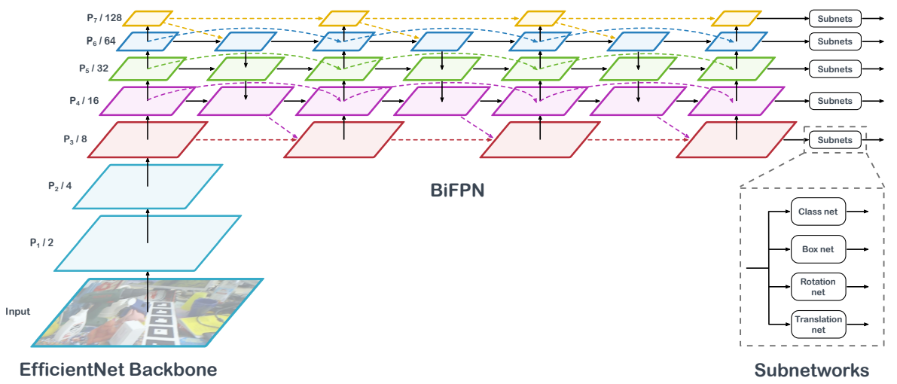
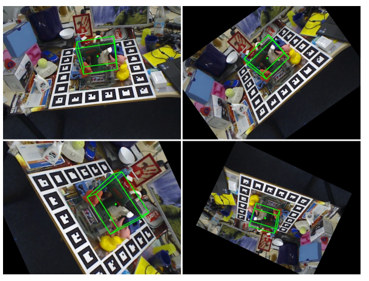
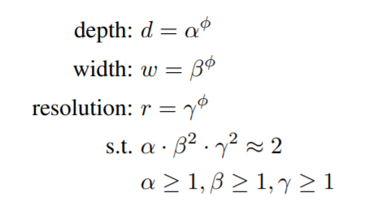
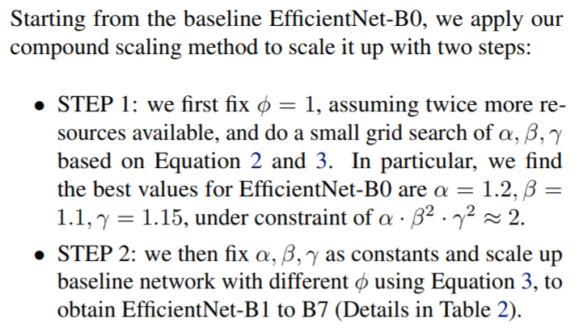
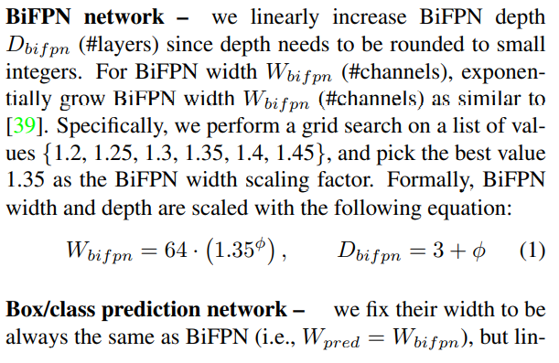
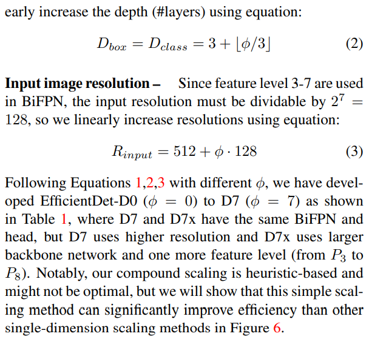
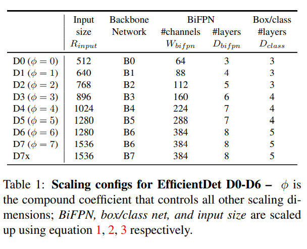
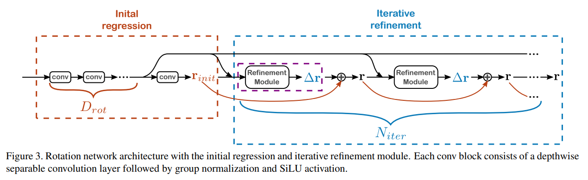

> EfficientPose: An efficient, accurate and scalable end-to-end 6D multi object pose estimation approach

## 一.核心思想

（1）基于EfficientDet的可扩展单阶段多实例位姿估计网络

（2）6D Augmentation效果显著

## 二.Method

1.EfficientDet

- 基本组成：backbone，深度可分离卷积，Inverted Residual block，Swish激活函数

- BiFPN：

（1）PANet的优势：FPN在实际应用中会面临高层级特征和较低层级特征之间的路径长的问题. 如在大型Backbone 如Resnet-152中, FPN低层信息经过多层网络到高层的时候, 由于路径过长导致部分低层级特征丢失, 然而低层级的特征对于大型实例的识别其实是很有用的. 我们需要一个能缩短低层级信息到高层级通过路径的方法。

（2）BiFPN相对于PANet的改进

1. 如果一个节点只有一个输入边并且没有特征融合, 那么它对特征网络的融合贡献较小, 这个节点可以删除(Simplified PANET)
2. 如果原始输入与输出节点处于同一级别, 则在它们之间添加一条额外的连接路径, 以便在不增加成本的情况下融合更多功能(BiFPN). 这点其实跟skip connection很相似.
3. 将每个双向（自上而下＆自下而上）路径作为一个特征网络层, 并且重复叠加相同的特征网络层多次, 以实现更高层次的特征融合(BiFPN Layers). 具体重复几次是速度和精度之间的权衡, 因此会在下面的复合缩放部分介绍.

（3）BiFPN的加权特征融合

无界融合，softmax融合与快速归一化融合

- Compound Scaling

用复合系数控制网络深度、宽度与分辨率，记复合系数为phi。

backbone：

BiFPN Network，Box/class prediction network，Input image resolution:

Total paremeters:

2.EfficientPose添加的分支网络

- rotation network

通过一个基础分支得到旋转估计的初值（这里用固定角），然后根据超参数设置位姿微调模块的网络深度与模块数量。在位姿微调子模块中使用了深度可分离卷积，组标准化和SiLU函数。组标准化的group数量同样由超参数决定。

- translation network

类似PoseCNN

3.6D Augmentation

绕z轴的旋转可以转换为6D空间的变换。

物体接近图像中心的时候，可以近似的使用尺度变换。

4.Color Augmentation

RandAugment

### Reference：

[1] https://zhuanlan.zhihu.com/p/208974735

[2] https://arxiv.org/pdf/1801.04381.pdf