# 一.通道注意力与空间注意力

> Squeeze-and-Excitation Networks

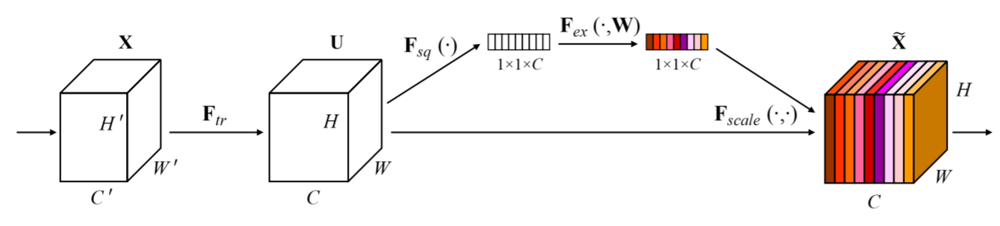

Instantiation

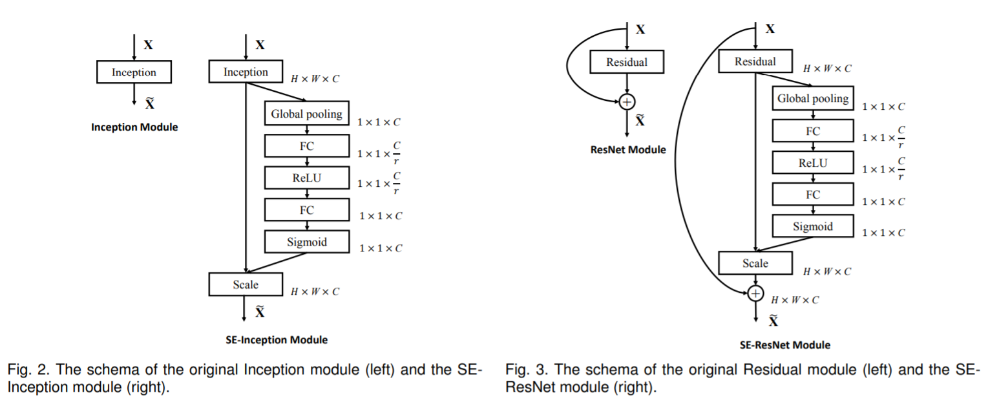

> CBAM: Convolutional Block Attention Module

Overview

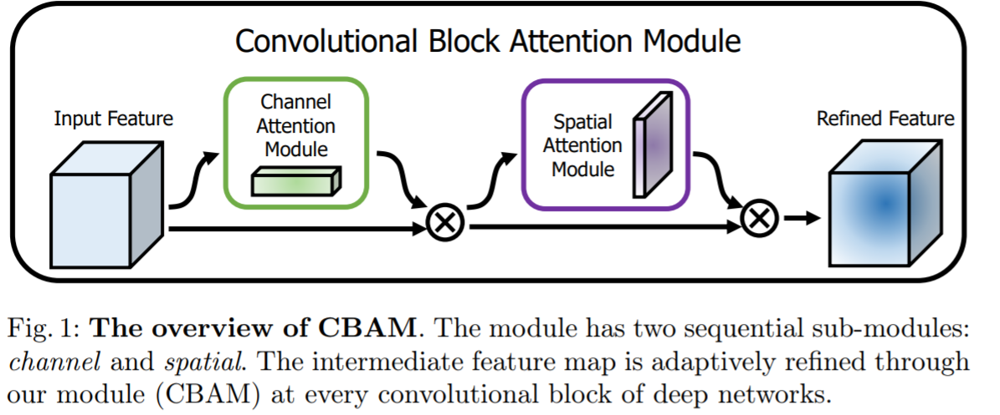

Sub module

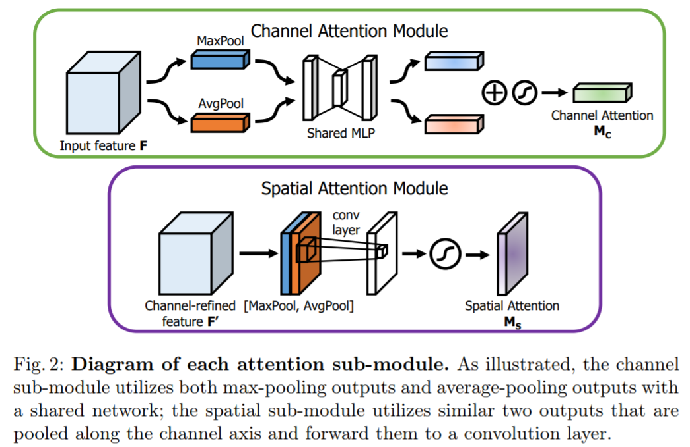

Grad-Cam Visualization

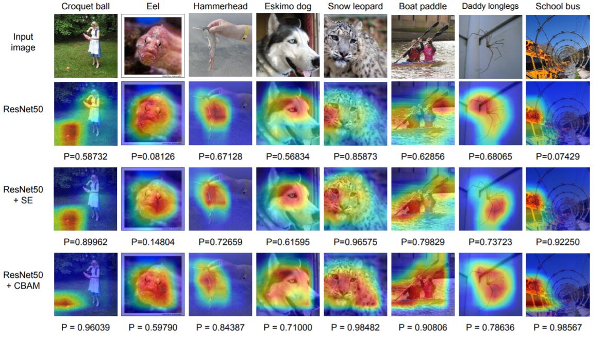

> SKNet

自适应的选择卷积核

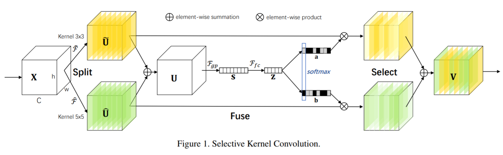

> ECA-Net

选择邻近的k个通道做卷积

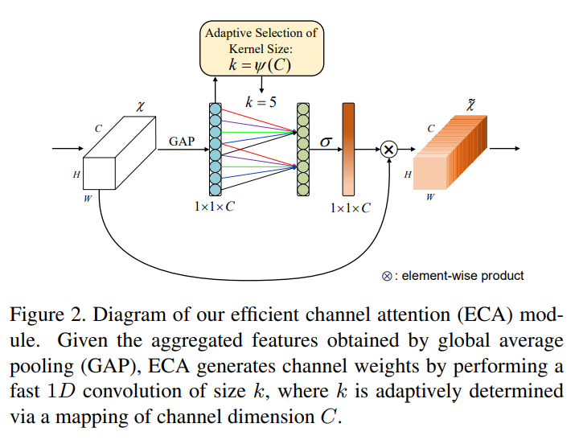

# 二. Nonlocal 

> Non-local Neural Networks

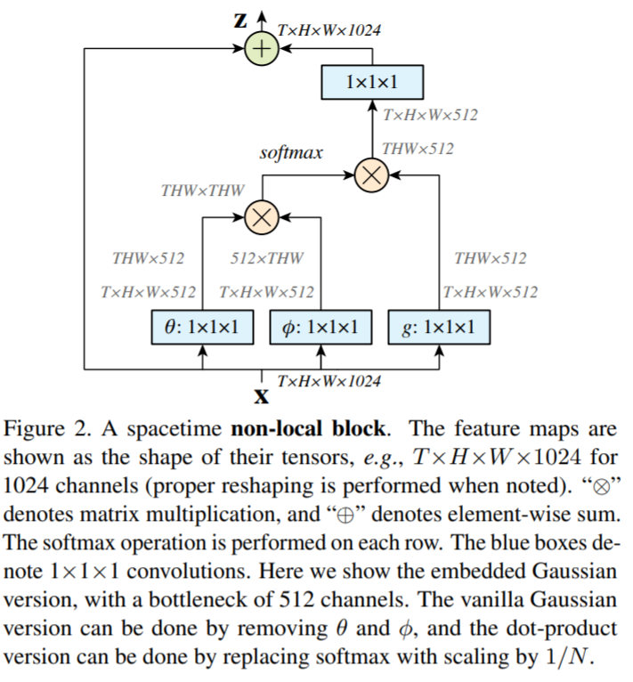

> Asymmetric Non-local Neural Networks for Semantic Segmentation

考虑到图像中的一些像素点比其他点更加重要。

用SPP来降低维度，N->S。

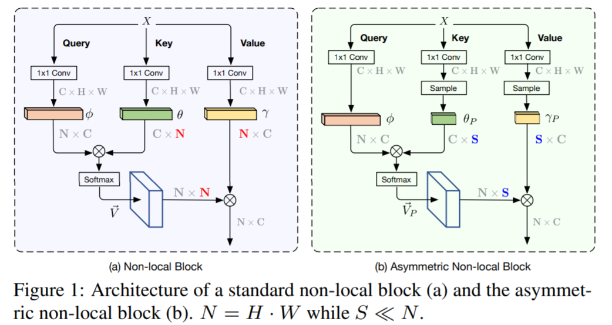

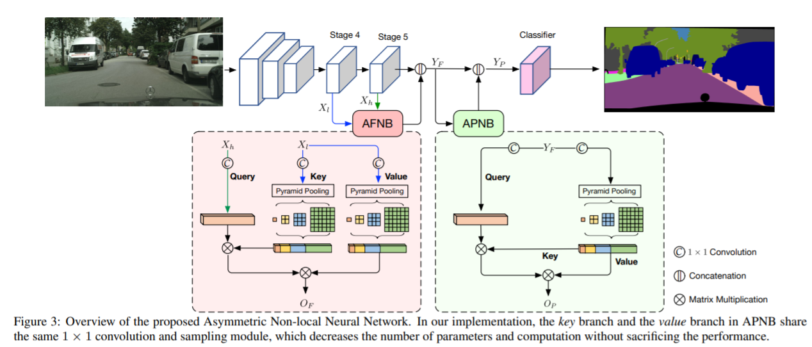

> Real-Time Semantic Segmentation With Fast Attention

Idea在Efficient Attention: Attention with Linear Complexities已经被提出。

快速的self-attention，还能扩展到Video语义分割中

核心思想：cos相似度代替softmax，改变self-attention的计算顺序

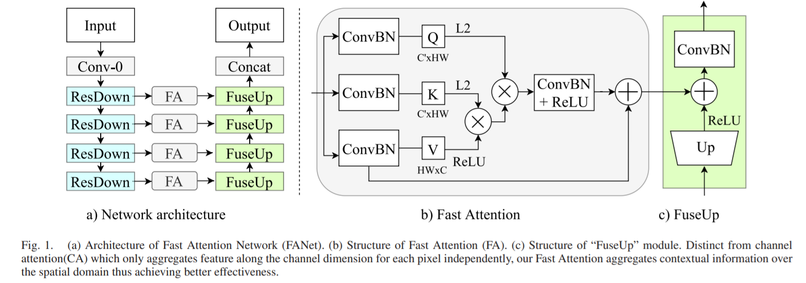

> GCNet: Non-local Networks Meet Squeeze-Excitation Networks and Beyond

结合SENet和Nonlocal，并简化。

应用：

> Non-locally Enhanced Encoder-Decoder Network for Single Image De-raining

将Nonlocal用于去雨。

> Efficient Image Super-Resolution Using Pixel Attention

像素级的注意力，CHW。

# 三.小目标识别

> Small Object Detection using Context and Attention

Extend ResNet-SSD with context and attention

Feature fusion module

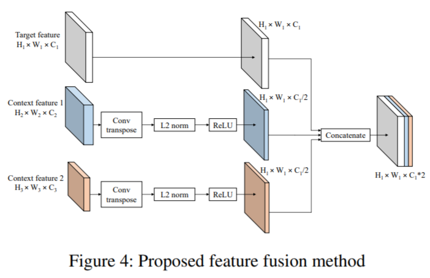

> HRDNet: High-resolution Detection Network for Small Objects

使用不同深度的网络处理不同分辨率的图像，然后用一个多尺度金字塔来融合

> MultiResolution Attention Extractor for Small Object Detection

对FPN的特征做Attention

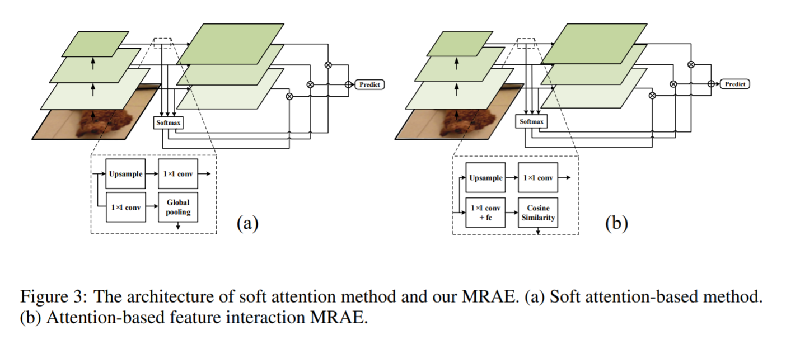

> IPG-Net: Image Pyramid Guidance Network for Small Object Detection

> Coordinate Attention for Efficient Mobile Network Design

宽度与高度上attention分离

> Polarized Self-Attention: Towards High-quality Pixel-wise Regression

使某个方向的特征保持高分辨率

https://zhuanlan.zhihu.com/p/392148142
