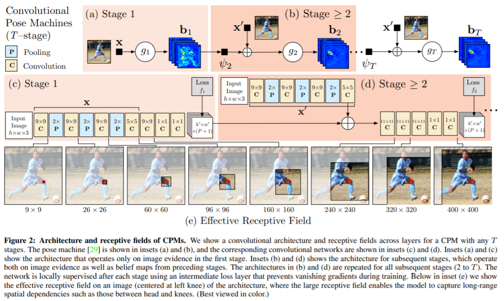
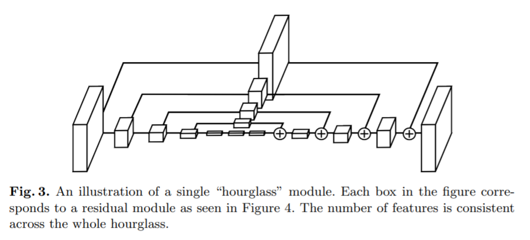
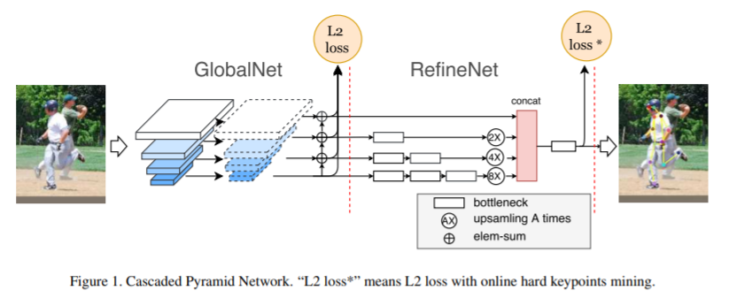
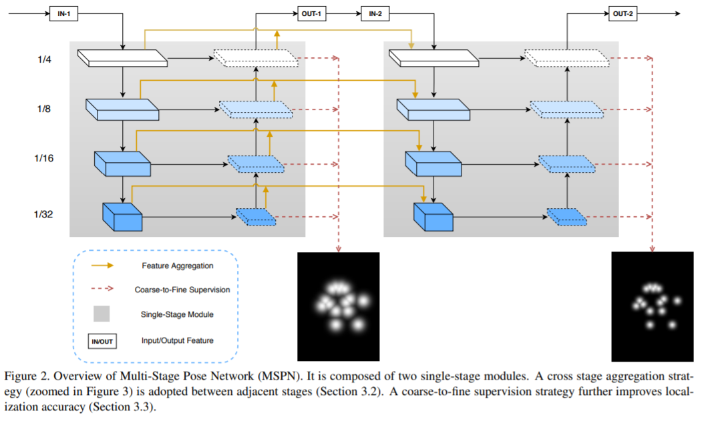

## Top-down

> Convolutional Pose Machine

1.第一阶段给出关节点的初始预测，后续阶段结合图像特征与置信图输出refine的置信图。

2.为了防止梯度消失，加入中间阶段的置信图作为监督。

3.部署过程

- 基于每个 scale，计算网络预测的各关节点 heatmap；
- 依次累加每个关节点对应的所有 scales 的 heatmaps；
- 根据累加 heatmaps，如果其最大值大于指定阈值，则该最大值所在位置 (x,y) 即为预测的关节点位置.

> Stacked Hourglass Networks for Human Pose Estimation

1.设计思想：子模块->子网络->全网络

2.单个hourglass与fcn的区别，编码与解码部分更加对称；多个hourglass组合

3.与CPM一样使用了intermediate supervision

> Cascaded Pyramid Network for Multi-Person Pose Estimation

1.对容易检测的关键点使用GlobalNet检测；对难以检测的关键点，增强感受野，通过RefineNet检测。

2.将ResNet-FPN作为backbone。

> Simple Baselines for Human Pose Estimation and Tracking

1.ResNet作为backbone

2.deconvolutional module

> Deep High-Resolution Representation Learning for Human Pose Estimation

1.保持多分辨率分支的存在

> ##### Rethinking on Multi-Stage Networks for Human Pose Estimation

1.GolbalNet与RefineNet跨阶段的融合

2.从粗到细的heatmap估计

## Bottom-Up

top-down方法的缺点：

1.性能受到detector的影响

2.运行时间随着人数的增多而增加

> Openpose (Realtime Multi-Person 2D Pose Estimation using Part Affinity Fields )

预测heatmap与paf，二分图最大权匹配算法

> Associative Embedding: End-to-End Learning for Joint Detection and Grouping

同时处理关键点检测与分组。

为heatmap上的每个值额外嵌入一个vector tag用于表示关键点是否属于同一个实例。

