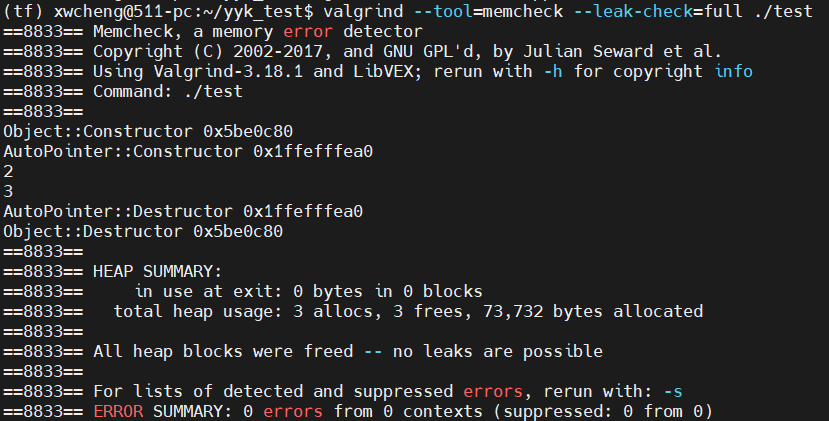

# 智能指针

C++中的智能指针利用RAII提供了自动内存管理的功能到。利用栈上对象来管理堆上内存，当智能指针对象离开其作用域时，默认在其析构函数中释放其管理的堆上变量；它能够在一定程度上减少内存泄露的发生。

#### 1.auto_ptr

首先创建一个Object模板类：

```c++
template<typename T>
class Object
{
public:
	// constructor
	Object() : t_() { cout << "Object::Constructor " << this << endl; }
	Object(T t) : t_(t) { cout << "Object::Constructor " << this << endl; }

	// copy-ctor
	Object(const Object &other) { cout << "Object::Copy-ctor " << this << endl; }

	// destructor
	~Object() { cout << "Object::Destructor " << this << endl; }

	void Set(T t) { t_ = t; }

	void Print() { cout << t_ << endl; }

private:
	T t_;
};
```

创建Object对象，但没有delete指针：

```c++
void AutoPointerFoo()
{
    Object<int>* o = new Object<int>(1);
    o->Print();
}
```

使用valgrind检测内存泄漏：


简化的auto_ptr实现：

```c++
template<typename T>
class AutoPointer
{
public:
    // constructor
    explicit AutoPointer(T* t = nullptr) noexcept : ptr_(t) { std::cout << "AutoPointer::Constructor " << this << std::endl; }
    
    // copy-ctor
    AutoPointer(AutoPointer<T>& other) noexcept : ptr_(other.Release()) { std::cout << "AutoPointer::Copyctor " << this << std::endl; }
    
    // assignment operator
    AutoPointer<T>& operator=(AutoPointer<T>& other)
    {
        std::cout << "AutoPointer::Assignment " << this << std::endl;
        Reset(other.Release());
        return *this;
    }

    // destructor
    ~AutoPointer() noexcept
    {
        std::cout << "AutoPointer::Destructor " << this << std::endl;
        delete ptr_;
    }

    T& operator*() noexcept { return *ptr_; }
    
    T* operator->() const noexcept { return ptr_; }
    
    T* Get() const noexcept { return ptr_; }
	
    // 释放当前指针
    T* Release() noexcept
    {
        T* ptr_ret = ptr_;
        ptr_ = nullptr;
        return ptr_ret;
    }

    // 重置当前指针
    void Reset(T* ptr_para) noexcept
    {
        if (ptr_ != ptr_para)
        {
            delete ptr_;
            ptr_ = ptr_para;
        }
    }

private:
    T *ptr_;
};
```

在堆上分配一个对象，然后由auto_ptr接管。

```
void AutoPointerFoo()
{
    Object<int>* o = new Object<int>(1);
    AutoPointer<Object<int>> a(o);
    (*o).Set(2);
    (*o).Print();
    o->Set(3);
    o->Print();
}
```



但AutoPointer的实现存在一些问题：

- 当进行拷贝或者赋值运算的时候，被操纵的AutoPointer对象可能在无意中失去对其自身所管理对象的控制权；
- 使用同一个Object指针初始化多个AutoPointer对象，会造成该Object指针被delete多次；
- AutoPointer默认使用delete进行删除操作，无法处理一个数组。

#### 2.unique_ptr

为解决auto_ptr存在的第1个问题和第3个问题，unique_ptr独占其管理的指针，通过move操作完成指针管理权的交接，并支持自定义删除器。

```c++
template<typename ElementType, typename DeleterType = DefaultDeleter>
class UniquePointer
{
public:
    // constructors
    UniquePointer() noexcept : ptr_(nullptr) { std::cout << "UniquePointer::Constructor " << this << std::endl; }
    explicit UniquePointer(ElementType* p) noexcept : ptr_(p) { std::cout << "UniquePointer::Constructor " << this << std::endl; }
    UniquePointer(ElementType* p, DeleterType d) noexcept : ptr_(p), deleter_(d) { std::cout << "UniquePointer::Constructor " << this << std::endl; }
​	
    // 对其管理的指针拥有独占所有权，通过禁用拷贝构造和赋值操作的方式防止了所有权转移的发生
    // copy-ctor
    UniquePointer(UniquePointer<ElementType, DeleterType>& other) noexcept = delete;
    // assignment operator
    UniquePointer<ElementType, DeleterType>& operator=(UniquePointer<ElementType, DeleterType>& other) = delete;
​
    // 通过 move 语义来让我们可以在特定情况下显式地转移指针
    // move-ctor
    UniquePointer(UniquePointer<ElementType, DeleterType>&& other) noexcept : ptr_(other.Release()), deleter_(std::move(other.deleter_)) { std::cout << "UniquePointer::Move-ctor " << this << std::endl; }
    // move assignment operator
    UniquePointer<ElementType, DeleterType>& operator=(UniquePointer<ElementType, DeleterType>&& other) noexcept
    {
        std::cout << "UniquePointer::MoveAssignment " << this << std::endl;
        ptr_ = other.Release();
        deleter_ = std::move(other.deleter_);
        return *this;
    }
​
    // destructor
    ~UniquePointer() noexcept
    {
        std::cout << "UniquePointer::Destructor " << this << std::endl;
        if (ptr_)
        {
            GetDeleter()(ptr_);
            ptr_ = nullptr;
        }
    }
​
    ElementType& operator*() noexcept { return *ptr_; }
​
    ElementType* operator->() const noexcept { return ptr_; }
​
    ElementType* Get() const noexcept { return ptr_; }
​
    const DeleterType& GetDeleter() const noexcept { return deleter_; }
​
    ElementType* Release() noexcept
    {
        ElementType* ret = nullptr;
        std::swap(ptr_, ret);
        return ret;
    }
​
    void Reset(ElementType* p) noexcept
    {
        if (ptr_ != p)
        {
            delete ptr_;
            ptr_ = p;
        }
    }
​
private:
    ElementType* ptr_;
    DeleterType deleter_;
};
```

自定义删除器

```
struct ArrayDeleter
{
    template<typename T>
    void operator()(T* p) const
    {
        static_assert(sizeof(p) > 0, "can't delete pointer to incomplete type");
        delete[] p;
    }
};
​
void UniquePointerFoo()
{
    int* int_arr = new int[1000000];
    ArrayDeleter array_deleter;
    UniquePointer<int, ArrayDeleter> u(int_arr, array_deleter);
}
```

3.shared_ptr

进一步解决auto_ptr的第2个问题，使用shared_ptr实现共同管理同一个对象的指针。

如果在同一时间有两个持有相同资源但位于不同线程中的智能指针同时访问他们所持有的资源，则可能会导致线程安全问题，因此我们还需要使用一定的机制来防止线程安全问题的发生；一般来说对引用计数器的加减修改是原子的，但对于共享资源的访问则需要使用互斥锁等机制保证线程安全。

```
template<typename ElementType, typename DeleterType = DefaultDeleter>
class SharedPointer
{
public:
    // constructors
    SharedPointer() noexcept : ptr_(nullptr), ref_count_(nullptr), deleter_(nullptr), mutex_(nullptr) { std::cout << "SharedPointer::Constructor " << this << std::endl; }
    explicit SharedPointer(ElementType* p) noexcept : ptr_(p), ref_count_(new int(1)), deleter_(new DeleterType()), mutex_(new mutex()) { std::cout << "SharedPointer::Constructor " << this << std::endl; }
    SharedPointer(ElementType* p, DeleterType *d) noexcept : ptr_(p), ref_count_(new int(1)), deleter_(d), mutex_(new mutex()) { std::cout << "SharedPointer::Constructor " << this << std::endl; }
    explicit SharedPointer(const WeakPointer<ElementType, DeleterType>& wp) noexcept : ptr_(wp.ptr_), ref_count_(wp.ref_count_), deleter_(wp.deleter_), mutex_(wp.mutex_)
    {
        std::cout << "SharedPointer::Constructor " << this << std::endl;
        IncreaseReferenceCount();
    }
​
    // copy-ctor
    SharedPointer(const SharedPointer<ElementType>& other) noexcept : ptr_(other.ptr_), ref_count_(other.ref_count_), deleter_(other.deleter_), mutex_(other.mutex_)
    {
        std::cout << "SharedPointer::Copy-ctor " << this << std::endl;
        IncreaseReferenceCount();
    }
​
    // assignment operator
    SharedPointer& operator=(SharedPointer<ElementType>& other)
    {
        if (ptr_ != other.ptr_)
        {
            Release();
            ptr_ = other.ptr_;
            ref_count_ = other.ref_count_;
            mutex_ = other.mutex_;
            deleter_ = other.deleter_;
            IncreaseReferenceCount();
        }
        return *this;
    }
​
    // destructor
    ~SharedPointer() noexcept
    {
        std::cout << "SharedPointer::Destructor " << this << std::endl;
        Release();
    }
​
    void Swap(SharedPointer<ElementType, DeleterType>& other)
    {
        std::swap(ptr_, other.ptr_);
        std::swap(ref_count_, other.ref_count_);
        std::swap(deleter_, other.deleter_);
        std::swap(mutex_, other.mutex_);
    }
​
    void Reset() { SharedPointer().Swap(*this); }
    void Reset(ElementType* p, DeleterType* d = nullptr) { SharedPointer(p, d).Swap(*this); }
​
    int UseCount() { return ref_count_ ? *ref_count_ : 0; }
​
    ElementType& operator*() noexcept { return *ptr_; }
​
    ElementType* operator->() const noexcept { return ptr_; }
​
    ElementType* Get() const noexcept { return ptr_; }
​
    const DeleterType& GetDeleter() const noexcept { return *deleter_; }
    
    void Release()
    {
        if (!ptr_)
            return;
        bool delete_flag = false;
        mutex_->lock();
        if (--(*ref_count_) == 0)
        {
            GetDeleter()(ptr_);
            delete ref_count_;
            delete deleter_;
            delete_flag = true;
        }
        mutex_->unlock();
        
        if (delete_flag)
        {
            delete mutex_;
        }
        
    }
​
    void IncreaseReferenceCount()
    {
        if (!ptr_)
            return;
        mutex_->lock();
        ++(*ref_count_);
        mutex_->unlock();
    }
    
    ElementType* ptr_;
    int *ref_count_;
    DeleterType* deleter_;
    mutex* mutex_;
};
```

4.weak_ptr

解决循环引用问题。

5.删除器

当使用智能指针管理的资源不是new分配的内存，记住传递给它一个删除器。

通过在编译时绑定删除器，unique_ptr避免了间接调用删除器的运行时开销；通过在运行时绑定删除器，shared_ptr使用户重载删除器更加方便。


reference:

[1] [内存检测工具valgrind](https://zhuanlan.zhihu.com/p/56538645)

[2] [智能指针的简单实现](https://zhuanlan.zhihu.com/p/351928941)
